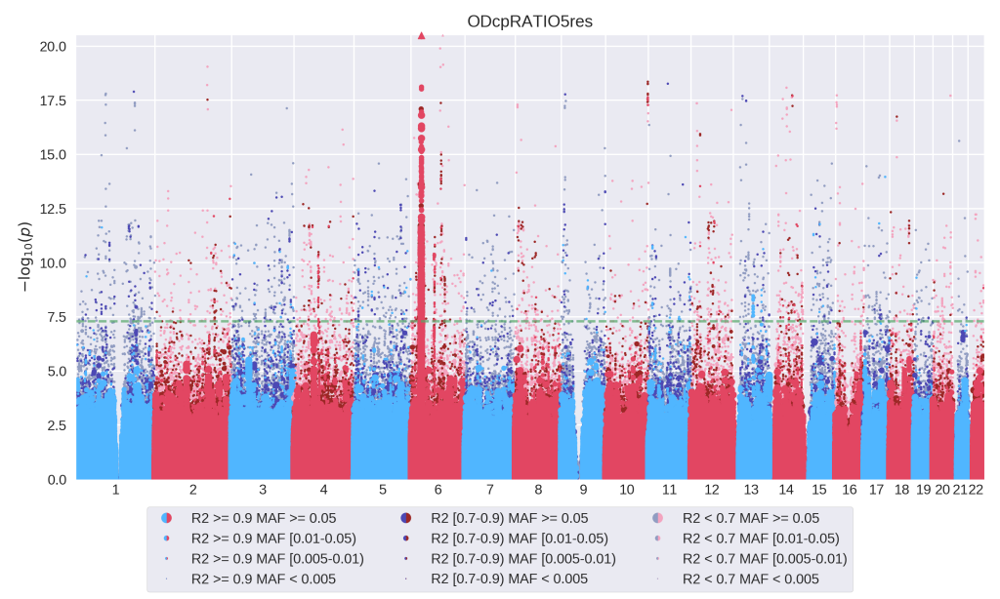

=================================
smhplot: Sparkling Manhattan Plot
=================================

Dazzling Manhattan plots for EPACTS_ results augmented with R² and MAF
data and several quality of life improvements.

.. _EPACTS: https://genome.sph.umich.edu/wiki/EPACTS

Authors and Copyright
---------------------

| `smhplot` is distributed under GNU AGPLv3+, WITHOUT ANY WARRANTY.
| Copyright(c) 2016-2021: Yuri D'Elia <yuri.delia@eurac.edu>
| Copyright(c) 2016-2021: EURAC, Institute of Genetic Medicine

`smhplot`'s GIT repository is publicly accessible at:

https://github.com/EuracBiomedicalResearch/smhplot
